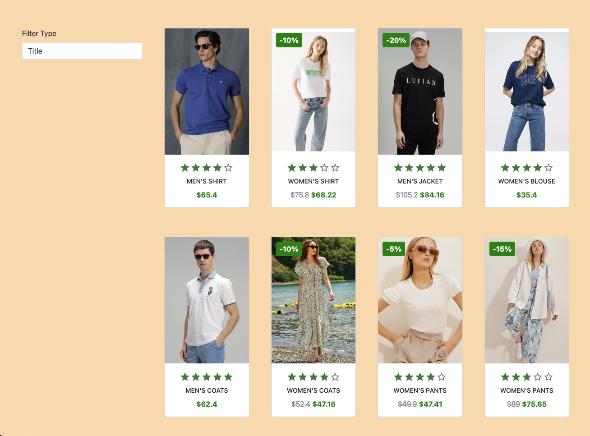

Check out the <a href="https://product-card-project.eozkanch.vercel.app/productList">Product Card</a>.

<h1>Project Introduction: E-Commerce Product List</h1>

This project is an e-commerce product listing application built using React and Next.js. The application allows users to filter and sort products according to their preferences. It also displays product images, prices, discounts, and ratings.

Key features and technical details of the project:

Developed using React and Next.js frameworks.
-Product data is provided in JSON format.
-Dynamically updates products based on filtering and sorting options.
-Utilizes React Bootstrap and MUI (Material-UI) libraries.
--User-friendly interface with responsive design compatible with different screen sizes.
-High-performance architecture.
-This project serves as an ideal starting point to build e-commerce applications or add new features to existing projects. It is designed for experienced developers familiar with React and Next.js, allowing for quick and efficient customization.

Additionally, this project serves as an educational resource for developers looking to learn about customizable components, data filtering and sorting logic, React Hooks (useState, useEffect), and data management.
